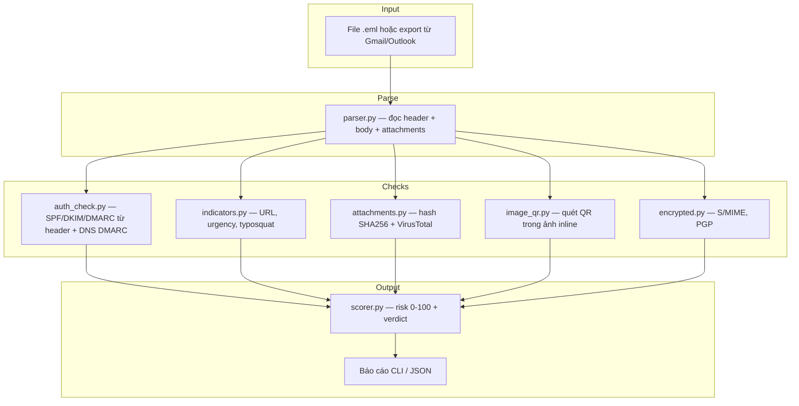
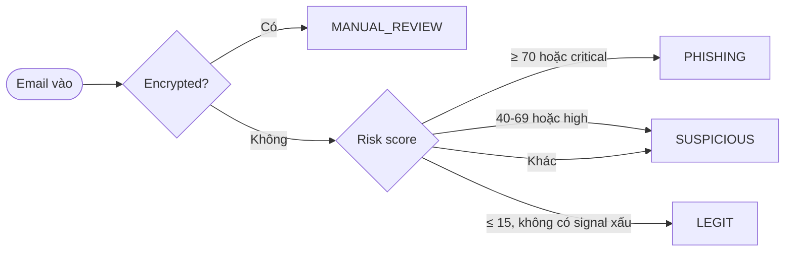

# Email Phishing Triage

Công cụ phân tích email (`.eml`) giúp **triage** — phân loại email **legit** vs **phishing** — cho kịch bản bạn quản lý inbox của một trang web bán hàng.

> Dự án portfolio Cyber Security — viết bằng Python, phù hợp người mới nhập môn.

## Sơ đồ tổng quan



## Luồng quyết định (verdict)



## Các lớp kiểm tra

| Lớp | Tool / thư viện | Ý nghĩa |
|-----|-----------------|--------|
| Parse email | Python `email` (stdlib) | Đọc header, text/html, file đính kèm |
| SPF / DKIM / DMARC | Header `Authentication-Results` | Mail server đã xác thực chữ ký & policy chưa |
| DMARC DNS | `dnspython` | Domain gửi có publish policy `p=reject` không |
| URL & nội dung | `beautifulsoup4`, regex | Link lừa đảo, IP thay domain, câu urgency |
| Attachment | SHA-256 + `vt-py` | Hash gửi VirusTotal (không upload file thật nếu đã có hash) |
| QR trong ảnh | `Pillow` + `pyzbar` | Phishing chỉ có ảnh + QR |
| Mã hóa | Heuristic S/MIME / PGP | Không đọc được body → review tay |

## Edge cases

### 1. Email encrypted (S/MIME / PGP)

- **Vấn đề:** Body và URL bên trong không đọc được.
- **Cách xử lý trong project:** Gán verdict `MANUAL_REVIEW`, vẫn phân tích **header ngoài** (From, Authentication-Results, Reply-To).
- **Thực tế:** Cần key giải mã trong môi trường sandbox, hoặc chính sách "không cho phép encrypted mail từ vendor lạ".

### 2. Email chỉ có ảnh + QR code

- **Vấn đề:** Không có link text; nạn nhân quét QR bằng điện thoại.
- **Cách xử lý:** `image_qr.py` decode QR → lấy URL → chạy lại bộ lọc URL (typosquat, shortener).
- **Lưu ý:** Cần cài `zbar` trên macOS: `brew install zbar`

## Cài đặt

```bash
cd email-phishing-triage
python3 -m venv .venv
source .venv/bin/activate
pip install -r requirements.txt

# macOS — cho quét QR
brew install zbar

cp .env.example .env
# Thêm VIRUSTOTAL_API_KEY (tùy chọn) và TRUSTED_DOMAINS=yourshop.com
```

## Chạy thử

```bash
# Email mẫu legit
python -m src.triage samples/legit_order.eml

# Email mẫu phishing
python -m src.triage samples/phishing_urgency.eml

# JSON (tích hợp pipeline sau này)
python -m src.triage samples/phishing_urgency.eml --json

# Tests
pytest -q
```

## Export email thật thành .eml

- **Gmail:** Mở email → ⋮ → "Download message"
- **Outlook:** Kéo email ra Desktop hoặc Save As `.eml`

Không commit file email thật có dữ liệu khách hàng lên GitHub.

## Mở rộng cho resume (roadmap)

1. **IMAP listener** — tự lấy mail từ `support@yourshop.com`
2. **Dashboard** — Streamlit hiển thị hàng đợi triage
3. **Threat intel** — URLhaus / PhishTank API
4. **Sandbox** — gửi attachment vào Cuckoo / ANY.RUN (lab)
5. **ML** — phân loại nội dung (sau khi đã hiểu rule-based)

## Cấu trúc thư mục

```
email-phishing-triage/
├── src/
│   ├── parser.py
│   ├── auth_check.py
│   ├── indicators.py
│   ├── attachments.py
│   ├── image_qr.py
│   ├── encrypted.py
│   ├── scorer.py
│   └── triage.py
├── samples/          # .eml demo (fictional)
├── tests/
├── requirements.txt
└── README.md
```

## Disclaimer

Tool này **hỗ trợ** phân tích, không thay thế quy trình bảo mật chính thức (SEG, MFA, đào tạo nhân viên). Luôn xử lý email nghi ngờ trong VM / sandbox.

## License

MIT
