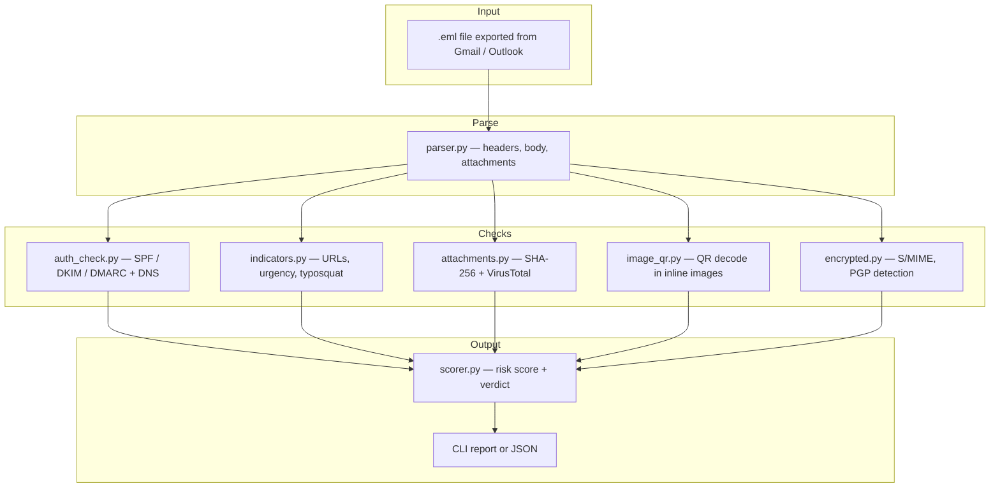
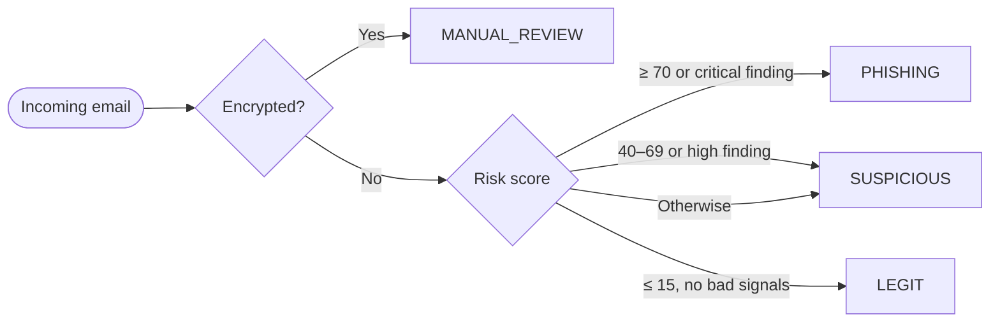

# Email Phishing Triage

A Python security tool that analyzes exported email files (`.eml`) to help distinguish **legitimate messages** from **phishing attempts**. Built as a portfolio project for cybersecurity and SOC analyst roles.

**Use case:** You manage the inbox for an e-commerce support address (e.g. `support@yourshop.com`) and need a repeatable way to triage suspicious messages before clicking links or opening attachments.

## Features

- **Email parsing** — headers, plain/HTML body, attachments, inline images
- **Authentication checks** — SPF, DKIM, DMARC from `Authentication-Results` headers
- **DMARC DNS lookup** — inspect sender domain policy (`p=none`, `quarantine`, `reject`)
- **URL analysis** — raw IP links, HTTP (non-TLS), typosquatting vs trusted domains
- **Content heuristics** — urgency/credential lure phrases, image-only emails
- **Attachment analysis** — dangerous file types, SHA-256 hashing
- **VirusTotal integration** — optional hash lookup (no file upload if hash is known)
- **QR code scanning** — decode QR payloads hidden in image-only phishing emails
- **Encrypted email handling** — flags S/MIME and PGP for manual review
- **Risk scoring** — 0–100 score with verdict: `legit`, `suspicious`, `phishing`, or `manual_review`

## Architecture



## Verdict flow



## Detection layers

| Layer | Library / tool | What it checks |
|-------|----------------|----------------|
| Email parsing | Python `email` (stdlib) | Headers, text/HTML, attachments |
| SPF / DKIM / DMARC | `Authentication-Results` header | Did the receiving server validate the sender? |
| DMARC DNS | `dnspython` | Does the sender domain publish a strict policy? |
| URLs & content | `beautifulsoup4`, regex | Phishing links, hidden URLs, lure language |
| Attachments | SHA-256 + `vt-py` | Known-malware hash lookup via VirusTotal |
| QR in images | `Pillow` + `pyzbar` | Image-only emails with QR-encoded URLs |
| Encryption | S/MIME / PGP heuristics | Body unreadable → manual review |

## Quick start

```bash
git clone https://github.com/minhcvu64/email-phishing-triage.git
cd email-phishing-triage

python3 -m venv .venv
source .venv/bin/activate        # Windows: .venv\Scripts\activate
pip install -r requirements.txt

# macOS — required for QR scanning
brew install zbar

cp .env.example .env
# Optional: set VIRUSTOTAL_API_KEY and TRUSTED_DOMAINS=yourshop.com
```

## Usage

```bash
# Analyze a sample legitimate order email
python -m src.triage samples/legit_order.eml

# Analyze a sample phishing email
python -m src.triage samples/phishing_urgency.eml

# JSON output (for automation / SIEM integration)
python -m src.triage samples/phishing_urgency.eml --json

# Run tests
pytest -q
```

### Example output (phishing sample)

```
Verdict: PHISHING
Risk score: 100/100

Findings:
  critical  auth     SPF failed — strong phishing indicator
  critical  auth     DKIM failed — strong phishing indicator
  critical  auth     DMARC failed — strong phishing indicator
  high      url      URL uses raw IP address
  medium    content  Urgency / credential lure phrase detected
```

## Export real emails as `.eml`

- **Gmail:** Open message → ⋮ → **Download message**
- **Outlook:** Drag message to Desktop, or **Save As** → `.eml`

> **Do not commit real customer emails to GitHub.** Use the included fictional samples for demos.

## Edge cases

### Encrypted email (S/MIME / PGP)

The body and embedded URLs cannot be analyzed automatically. The tool assigns `manual_review` but still inspects outer headers (`From`, `Authentication-Results`, `Reply-To`, `Return-Path`).

### Image-only email with QR code

Attackers hide malicious URLs inside QR codes so there are no clickable links in the HTML. The tool decodes QR payloads from inline/attached images and runs URL checks on the result.

## Project structure

```
email-phishing-triage/
├── src/
│   ├── triage.py        # CLI entry point & pipeline orchestration
│   ├── parser.py        # .eml parsing
│   ├── auth_check.py    # SPF / DKIM / DMARC
│   ├── indicators.py    # URL & content heuristics
│   ├── attachments.py   # file hashing & VirusTotal
│   ├── image_qr.py      # QR code extraction
│   ├── encrypted.py     # encryption detection
│   ├── scorer.py        # risk score & verdict
│   └── models.py        # data structures
├── samples/             # fictional demo .eml files
├── tests/
├── requirements.txt
└── README.md
```

## Roadmap

- [ ] IMAP listener — auto-fetch from `support@yourshop.com`
- [ ] Streamlit dashboard — triage queue UI
- [ ] Threat intel feeds — URLhaus / PhishTank
- [ ] Attachment sandbox — Cuckoo / ANY.RUN (lab environment)
- [ ] ML classifier — content-based scoring after rule-based baseline

## Interview talking points

1. **Defense in depth** — no single signal is trusted; auth, content, attachments, and QR checks are combined into a weighted score.
2. **Limits of automation** — encrypted mail and BEC (business email compromise) still require human review.
3. **Safe analysis workflow** — analyze `.eml` exports offline; never open suspicious attachments on a production machine.
4. **Real-world stack** — this tool complements (not replaces) SEG products (Proofpoint, Mimecast) and provider-level spam filters.

## Disclaimer

This tool **assists** with triage. It does not replace enterprise email security gateways, MFA, or security awareness training. Always handle suspicious email in an isolated VM or sandbox.

## License

MIT
